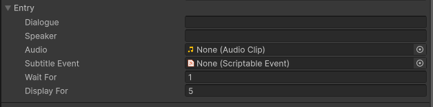
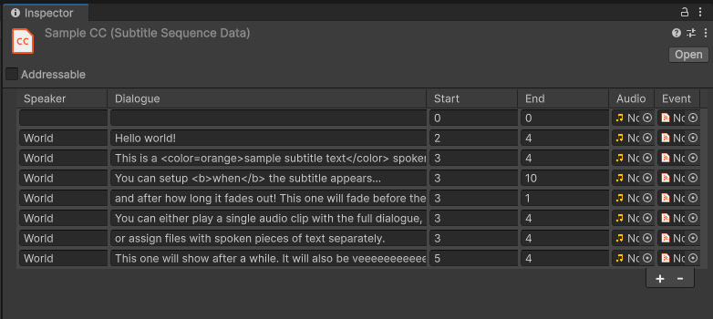

# Data
Subtitler data can be represented as either a standalone entry (ISubtitleEntry) or a sequence of entries (ISubtitleSequence). Subtitler provides ready-to-use implementations of both.

## Subtitler Entry

This structure represents a single line of Closed-Captions, including details on timing (relative to previous entries), events (such as triggering achievements or NPC actions), and the speaker (if applicable).

## Subtitler Sequence
Sequences are ScriptableObjects and are the preferred method for creating subtitles. They contain a list of SubtitlerEntries played from top to bottom.

| Parameter | Description |
| -- | -- |
| Speaker      | The entity's name, highlighted in captions. Leave empty to omit.|
| Dialogue   | The dialogue or sound to display. |
| Start   | The delay before this entry appears, relative to the previous entry. |
| End | The duration the subtitle is displayed. |
| Audio | An AudioClip to be played. (Requires an AudioSource reference. See [Containers](containers.md) or the API reference.)
| Event | An event triggered when the subtitle displays. See [Events](event.md).