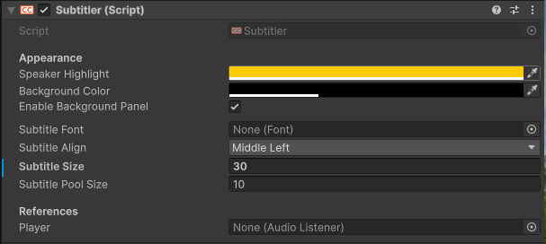

# Subtitler Prefab
To use Subtitler, drag the Subtitler Prefab from the package into your scene. Alternatively, copy it from the provided Samples.

## Changing Visuals
Subtitler exposes some commonly changed properties like font, font-size, text alignment (centered/left-aligned), background color and speaker highlight color.

### Common Questions

#### Subtitler does not render on top of my UI when I dont want it to and vice-versa
Change Subtitler's UIDocument Sort Order

#### Advanced: I wish to change the UI in depth / integrate Subtitler into my own UIToolkit document
For deep UI changes or integration into your UIToolkit document, copy the Subtitler VisualTreeAsset and USS styling sheets. Retain the same classes and overridden values for proper layout. Be aware that Subtitler VisualElement Labels are dynamically instantiated, not copied.