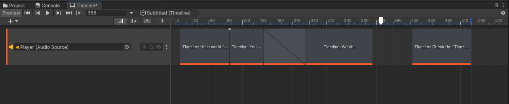
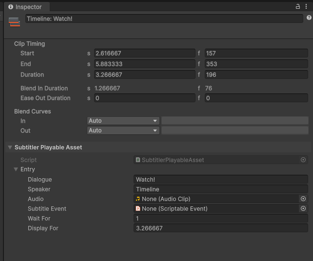

# Subtitler Track
Think of a Subtitler track like a Subtitler Sequence left to right. You can create an Subtitler under *+/Gasimo.Subtitler.Timeline/Subtitler Track*.

## Subtitler Entry (Clip)
Add entries by right-clicking on the Subtitler Track and selecting 'Add Subtitler Playable Asset'.

### Timing
In the Timeline, Subtitler Entry timing aligns with clip timings. Entries trigger precisely and display for the clip’s duration. 
> Altering the Entry’s WaitFor property introduces delays, causing discrepancies with Timeline playback.